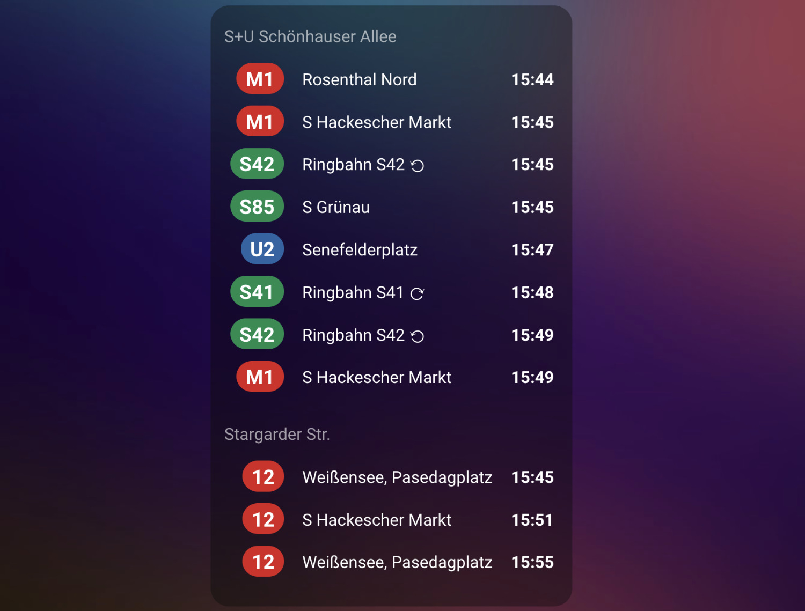
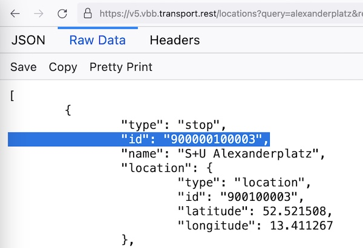

# Berlin (BVG) and Brandenburg (VBB) transport widget for Home Assistant

Custom integration that displays upcoming departures from your defined public transport stops for Berlin and Brandenburg.

This repository contains only the integration, **the Lovelace card itself lives here: https://github.com/vas3k/lovelace-berlin-transport-card**

You need to install them both. Preferably through HACS. We have separated two repositories to make installation through it more convenient.



> I use [iOS Dark Mode Theme](https://github.com/basnijholt/lovelace-ios-dark-mode-theme) by @basnijholt, installed from [HACS](https://hacs.xyz/)

## 💿 Installation

The component consists of two parts:

1. A sensor, which tracks departures via [VBB public API](https://v6.vbb.transport.rest/api.html#get-stopsiddepartures) every 90 seconds. This is this repository.
2. A widget (card) for the lovelace dashboard, which displays upcoming transport in a nice way. It has its own [separate repository](https://github.com/vas3k/lovelace-berlin-transport-card) with installation instructions.

### Install sensor component via HACS

1. Add this [repository](https://github.com/vas3k/home-assistant-berlin-transport) as a custom repository in HACS in the category "integration".
1. Add `Berlin (BVG) and Brandenburg (VBB) transport` as a new integration under `Settings` -> `Devices & services`  
1. Search for your stop. Partial matches are supported — up to 15 relevant stops will be listed.
1. Select the stop you want to monitor.
1. (Optional) Configure additional parameters:
    - Direction: Use `stop_id` to filter departures by direction. Provide the stop_id of stop along the intended lines or their final destination. Multiple values can be specified using a comma-separated list. See [below](#how-do-i-find-my-stop_id) for how to find the `stop id`.
    - Exclude stops: List of `stop_id` which should be excluded. Use if BVG/VBB is returning departures from nearby stops. Multiple values can be specified using a comma-separated list.
    - Duration: Defines how many minutes into the future departures should be fetched. Default is 10 minutes.
    - Walking time: Enter the time needed to walk to the stop. This prevents unreachable departures from being shown.
    - Enable official VBB line colors: Optionally enable official VBB line colors. By default, predefined colors are used.
    - Hide Ringbahn ⟳/⟲: Optionally hide Ringbahn services running clockwise or counter‑clockwise.  
        - Example: Suppose you want to monitor departures from *Treptower Park*. You set the direction filter to *900077106 (S Sonnenallee)*, because you only want to see trains heading clockwise from *Treptower Park*. However, the Ringbahn S42 ⟲ (counter‑clockwise) will also eventually reach *S Sonnenallee*, so the BVG/VBB API will return those departures as well. This option lets you hide such entries.
    - Transport options: Choose which transport types (e.g., bus, ferry) to show or hide.
1. Done. If you want to change options later on, just run through the steps again with the same stop. The previous entity will be overwritten automatically.

### Install sensor component manually

#### How do I find my `stop_id`?

Unfortunately, I didn't have time to figure out a proper user-friendly approach of adding new components to Home Assistant, so you will have to do some routine work of finding the IDs of the nearest transport stops to you. Sorry about that :)

Simply use this URL: **https://v6.vbb.transport.rest/locations?results=1&query=alexanderplatz**

Replace `alexanderplatz` with the name of your own stop.



> 🧐 **Pro tip:**
> You can also use their [location-based API](https://v6.vbb.transport.rest/api.html#get-stopsnearby) to find all stops nearby using your GPS coordinates.

**1.** Copy the whole [berlin_transport](./custom_components/) directory to the `custom_components` folder of your Home Assistant installation. If you can't find the `custom_components` directory at the same level with your `configuration.yml` — simply create it yourself and put `berlin_transport` there.

**2.** Go to Home Assistant web interface -> `Developer Tools` -> `Check and Restart` and click "Restart" button. It will reload all components in the system.

**3.** Now you can add your new custom sensor to the corresponding section in the `configuration.yml` file.

```yaml
sensor:
  - platform: berlin_transport
    departures:
      - name: "S+U Schönhauser Allee" # free-form name, only for display purposes
        stop_id: 900110001 # actual Stop ID for the API
        # direction: 900110002,900007102 # Optional stop_id to limit departures for a specific direction (same URL as to find the stop_id), multiple Values can be specified using a comma separated list
        # walking_time: 5 # Optional parameter with value in minutes that hides transport closer than N minutes
        # suburban: false # Optionally hide transport options
        # show_official_line_colors: true # Optionally enable official VBB line colors. By default predefined colors will be used.
        # duration: 30 # Optional (default 10), query departures for how many minutes from now?
      - name: "Stargarder Str." # currently you have to add more than one stop to track
        stop_id: 900000110501
        # direction: 900000100002 # Optional stop_id to limit departures for a specific direction (same URL as to find the stop_id), multiple Values can be specified using a comma separated list
        # excluded_stops: 900110502,900007102 # Exclude these stop IDs from the departures, duplicate departures may be shown for nearby stations
        # walking_time: 5 # Optional parameter with value in minutes that hide transport closer than N minutes
        # show_official_line_colors: true # Optionally enable official VBB line colors. By default predefined colors will be used.
        # duration: 30 # Optional (default 10), query departures for how many minutes from now?
```

**4.** Restart Home Assistant core again and you should now see two new entities (however, it may take some time for them to fetch new data). If you don't see anything new — check the logs (Settings -> System -> Logs). Some error should pop up there.

### Add the lovelace card

Go to [lovelace-berlin-transport-card](https://github.com/vas3k/lovelace-berlin-transport-card) repo and follow installation instructions there.

## 👩‍💻 Technical details

This sensor uses VBB Public API to fetch all transport information.

- API docs: https://v5.vbb.transport.rest/api.html
- Rate limit: 100 req/min
- Format: [HAFAS](https://github.com/public-transport/hafas-client)

The component updates every 60-90 seconds, but it makes a separate request for each stop. That's usually enough, but I wouldn't recommend adding dozens of different stops so you don't hit the rate limit.

The VBB API is a bit unstable (as you can guess), so sometimes it gives random 503 or Timeout errors. This is normal. I haven't found how to overcome this, but it doesn't cause any problems other than warning messages in the logs.

After fetching the API, it creates one entity for each stop and writes 10 upcoming departures into `attributes.departures`. The entity state is not really used anywhere, it just shows the next departure in a human-readable format. If you have any ideas how to use it better — welcome to Github Issues.

> 🤔
> In principle, the HAFAS format is standardized in many other cities too, so you should have no problem adapting this component to more places if you wish. Check out [transport.rest](https://transport.rest/) for an inspiration.

## ❤️ Contributions

Contributions are welcome. Feel free to [open a PR](https://github.com/vas3k/home-assistant-berlin-transport/pulls) and send it to review. If you are unsure, [open an Issue](https://github.com/vas3k/home-assistant-berlin-transport/issues) and ask for advice.

## 🐛 Bug reports and feature requests

Since this is my small hobby project, I cannot guarantee you a 100% support or any help with configuring your dashboards. I hope for your understanding.

- **If you find a bug** - open [an Issue](https://github.com/vas3k/home-assistant-berlin-transport/issues) and describe the exact steps to reproduce it. Attach screenshots, copy all logs and other details to help me find the problem.
- **If you're missing a certain feature**, describe it in Issues and try to code it yourself. It's not hard. At the very least, you can try to [bribe me with a PayPal donation](https://www.paypal.com/paypalme/vas3kcom) to make the feature just for you :)

## 👮‍♀️ License

- [MIT](./LICENSE.md)
