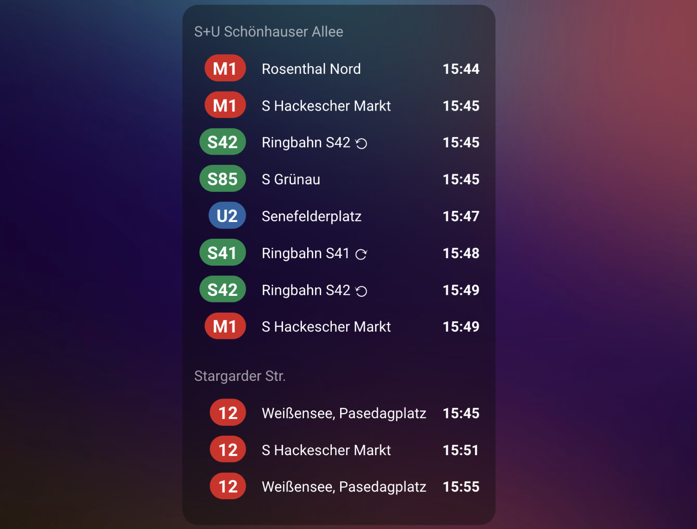
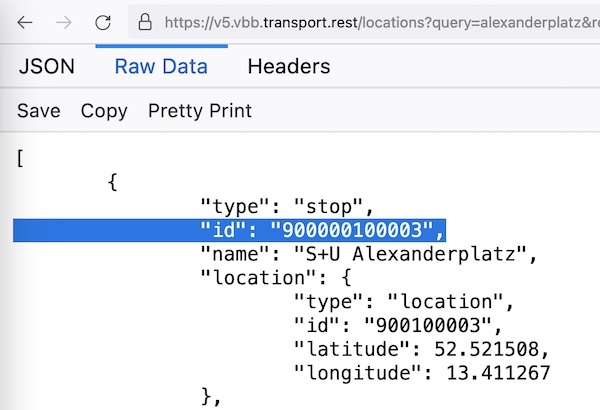

# Berlin (BVG) and Brandenburg (VBB) transport widget for Home Assistant

Custom integration that displays upcoming departures from your defined public transport stops for Berlin and Brandenburg.

This repository contains only the integration, **the Lovelace card itself lives here: https://github.com/vas3k/lovelace-berlin-transport-card**

You need to install them both. Preferably through HACS. We have separated two repositories to make installation through it more convenient.



> I use [iOS Dark Mode Theme](https://github.com/basnijholt/lovelace-ios-dark-mode-theme) by @basnijholt, installed from [HACS](https://hacs.xyz/)

## 📋 Requirements

- Home Assistant **2025.3.0** or newer. The integration uses config subentries, which were introduced in that release.
- Access to a [vbb-rest](https://github.com/derhuerst/vbb-rest) API server. By default the public instance at `https://v6.vbb.transport.rest` is used, but you can point the integration at your own — see [Using your own API server](#-using-your-own-api-server).

## 💿 Installation

The component consists of two parts:

1. A sensor, which tracks departures via the [VBB public API](https://v6.vbb.transport.rest/api.html#get-stopsiddepartures) every 90 seconds. This is this repository.
2. A widget (card) for the Lovelace dashboard, which displays upcoming transport in a nice way. It has its own [separate repository](https://github.com/vas3k/lovelace-berlin-transport-card) with installation instructions.

### Install the sensor component via HACS

Add this [repository](https://github.com/vas3k/home-assistant-berlin-transport) as a custom repository in HACS in the category "integration", install it, and restart Home Assistant.

## ⚙️ Configuration

The integration is organised as a **hub** with one **stop** per subentry. The hub holds the API settings; each stop under it is a sensor entity. This means you configure the API endpoint once and add as many stops as you like underneath it.

### 1. Add the hub

Go to `Settings` → `Devices & services` → `Add integration` and search for `Berlin (BVG) and Brandenburg (VBB) transport`. You will be asked for:

| Setting                               | Default                         | Description |
| ------------------------------------- | ------------------------------- | ----------- |
| API endpoint URL                      | `https://v6.vbb.transport.rest` | Base URL of the vbb-rest server to query. No trailing slash. |
| Maximum number of results per request | `15`                            | How many departures to request per stop, and how many results to show when searching for a stop. |
| Fallback time in minutes              | `15`                            | If the API becomes unreachable, keep showing the last known departures for this long before marking the sensor unavailable. |

If you just want the public API, accept the defaults.

### 2. Add stops to the hub

On the integration's page, click `Add stop`. Then:

1. Search for your stop by name. Partial matches work — up to "maximum results" stops will be listed.
2. Select the stop you want to monitor from the dropdown.
3. Optionally configure the per-stop settings below.

Repeat for every stop you want. All stops under one hub share the same API endpoint and request settings.

#### Per-stop settings

| Setting                               | Default | Description |
| ------------------------------------- | ------- | ----------- |
| Walking time in minutes               | `1`     | Time needed to walk to the stop. Departures you could not reach in time are hidden. |
| Filter departures by direction        | not set | `stop_id`s along the intended lines, or their final destinations. Add one value per entry. See [How do I find my stop_id?](#how-do-i-find-my-stop_id). |
| Exclude nearby stops with IDs         | not set | `stop_id`s to drop from the results. Add one value per entry. Use this when the API returns departures from nearby stops. |
| Exclude lines by name                 | not set | Line names to drop from the results, e.g. `S41`. Add one value per entry. |
| Show departures for how many minutes? | not set | How far into the future to fetch departures. Leave empty to use the API's own default window. |
| Enable official VBB line colors       | off     | Use the colors reported by the API instead of the predefined ones. |
| Transport types                       | all on  | Which products to include: S-Bahn, U-Bahn, Tram, Bus, Ferry, IC/ICE, RB/RE. |

### 3. Change settings later

- **Hub settings** (API endpoint, maximum results, fallback time): open the hub's `⋮` menu and choose `Configure`.
- **Stop settings**: open the stop's `⋮` menu and choose `Reconfigure`. The stop itself cannot be changed — to monitor a different stop, add a new one and delete the old.

Both take effect immediately; the integration reloads itself.

## 🏠 Using your own API server

The public instance at `v6.vbb.transport.rest` is shared and occasionally rate limited or unavailable (see [#36](https://github.com/vas3k/home-assistant-berlin-transport/issues/36)). If you depend on it, run your own copy of [derhuerst/vbb-rest](https://github.com/derhuerst/vbb-rest) — for example with Docker — and set the API endpoint on the hub to your instance, e.g. `http://vbb-rest.local:3000`.

A home assistant addon for the server is also available at https://github.com/Cornelicorn/homeassistant-addons.

## ⬆️ Upgrading from earlier versions

Older versions created **one config entry per stop**. On first start after the update, all of those entries are migrated automatically into a **single hub**, with each old entry becoming a stop underneath it. Your entities keep their IDs, so history and dashboards are unaffected.

The direction and exclusion filters used to be stored as a single comma-separated string. They are now lists, and existing stops are converted automatically on the same first start. Only [YAML configurations](#-yaml-configuration-legacy) have to be updated by hand.

Downgrading to a pre-hub version is not supported; the config entries cannot be converted back.

## 📝 YAML configuration (legacy)

YAML setup still works for existing configurations, but it does not support the API endpoint, maximum results, or fallback time settings — those always use the defaults. New setups should use the UI.

```yaml
sensor:
  - platform: berlin_transport
    departures:
      - name: "S+U Schönhauser Allee" # free-form name, only for display purposes
        stop_id: 900110001 # actual Stop ID for the API
        # direction: # Optional list of stop_ids to limit departures for specific directions (same URL as to find the stop_id)
        #   - 900110002
        #   - 900007102
        # excluded_lines: # Optional list of line names to exclude
        #   - S41
        # walking_time: 5 # Optional parameter with value in minutes that hides transport closer than N minutes
        # suburban: false # Optionally hide transport options
        # show_official_line_colors: true # Optionally enable official VBB line colors. By default predefined colors will be used.
        # duration: 30 # Optional (default 10), query departures for how many minutes from now?
      - name: "Stargarder Str." # currently you have to add more than one stop to track
        stop_id: 900000110501
        # direction: # Optional list of stop_ids to limit departures for specific directions (same URL as to find the stop_id)
        #   - 900000100002
        # excluded_stops: # Exclude these stop IDs from the departures, duplicate departures may be shown for nearby stations
        #   - 900110502
        #   - 900007102
        # walking_time: 5 # Optional parameter with value in minutes that hide transport closer than N minutes
        # show_official_line_colors: true # Optionally enable official VBB line colors. By default predefined colors will be used.
        # duration: 30 # Optional (default 10), query departures for how many minutes from now?
```

`direction`, `excluded_stops` and `excluded_lines` used to be written as a single comma-separated string (`excluded_lines: S41,S42`). That form still works, but it is deprecated and will be removed in a future release — Home Assistant raises a repair notice under `Settings` → `Devices & services` → `Repairs` naming the stops that still use it. Rewrite each of them as a list as shown above and restart. A single value can stay a plain scalar (`excluded_lines: S41`).

To install manually, copy the whole [berlin_transport](./custom_components/) directory into the `custom_components` folder of your Home Assistant installation (create it next to `configuration.yaml` if it doesn't exist), then restart Home Assistant.

### How do I find my `stop_id`?

The UI flow searches for stops for you, so you only need this for YAML, or for the direction and exclusion filters.

Use this URL: **https://v6.vbb.transport.rest/locations?results=1&query=alexanderplatz**

Replace `alexanderplatz` with the name of your own stop. If you self-host, use your own server's address instead.



> 🧐 **Pro tip:**
> You can also use the [location-based API](https://v6.vbb.transport.rest/api.html#get-stopsnearby) to find all stops nearby using your GPS coordinates.

## 🎨 Add the Lovelace card

Go to the [lovelace-berlin-transport-card](https://github.com/vas3k/lovelace-berlin-transport-card) repo and follow the installation instructions there.

## 👩‍💻 Technical details

This sensor uses the VBB public API to fetch all transport information.

- API docs: https://v6.vbb.transport.rest/api.html
- Rate limit on the public instance: 100 req/min
- Format: [HAFAS](https://github.com/public-transport/hafas-client)

Every stop is polled every 90 seconds, and each stop is a separate request. If you filter by direction, one request is made per direction. On the public API, keep that in mind before adding dozens of stops so you don't hit the rate limit.

The public API is a bit unstable (as you can guess), so sometimes it returns random 503 or timeout errors. This is normal. When a request fails, the last known departures are kept for the configured fallback time and stale ones are dropped as they pass; after that the sensor goes unavailable.

Each stop becomes one entity, with the upcoming departures written into `attributes.departures` (as many as the hub's "maximum results" setting). The entity state is not really used anywhere, it just shows the next departure in a human-readable format. If you have any ideas how to use it better — welcome to GitHub Issues.

> 🤔
> In principle, the HAFAS format is standardized in many other cities too, so you should have no problem adapting this component to more places if you wish. Check out [transport.rest](https://transport.rest/) for inspiration.

## ❤️ Contributions

Contributions are welcome. Feel free to [open a PR](https://github.com/vas3k/home-assistant-berlin-transport/pulls) and send it for review. If you are unsure, [open an Issue](https://github.com/vas3k/home-assistant-berlin-transport/issues) and ask for advice.

To run the same checks CI runs, install the development dependencies (any Python that Home Assistant supports will do — mypy targets 3.13 either way):

```bash
python -m venv .venv && source .venv/bin/activate
pip install -r requirements-dev.txt

black --extend-exclude="custom_components/berlin_transport/const.py" --diff --check .
pylint $(git ls-files '*.py')
mypy $(git ls-files '*.py')
```

`requirements-dev.txt` installs Home Assistant itself, so mypy type-checks the `homeassistant`, `aiohttp` and `voluptuous` imports instead of ignoring them.

## 🐛 Bug reports and feature requests

This is a hobby project, so we cannot guarantee 100% support or help with configuring your dashboards. We hope for your understanding.

- **If you find a bug**, open [an Issue](https://github.com/vas3k/home-assistant-berlin-transport/issues) and describe the exact steps to reproduce it. Attach screenshots, copy all logs and other details to help find the problem. Please mention whether you use the public API or your own server.
- **If you're missing a certain feature**, describe it in Issues and try to code it yourself. It's not hard. At the very least, you can try to [bribe @vas3k with a PayPal donation](https://www.paypal.com/paypalme/vas3kcom) :)

## 👮‍♀️ License

- [MIT](./LICENSE.md)
